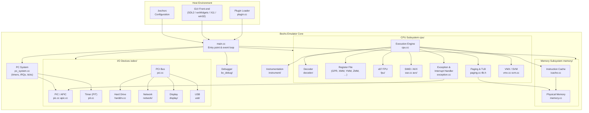
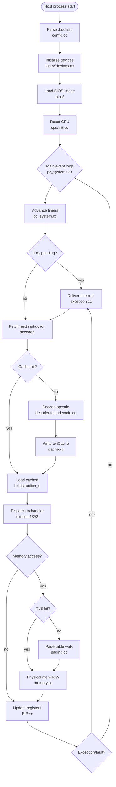
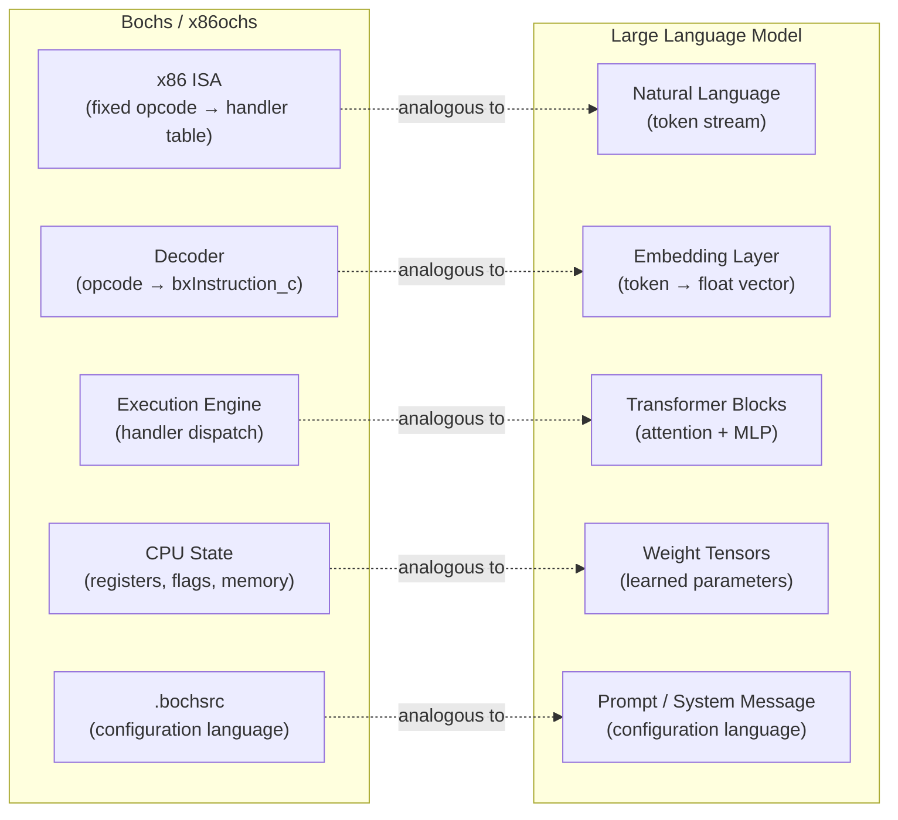
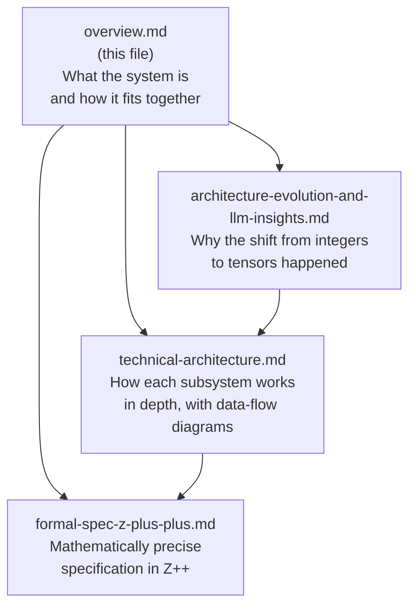

# x86ochs — Comprehensive Overview

> x86ochs is a fork/variant of the [Bochs](https://bochs.sourceforge.io/) open-source IA-32 / x86-64 PC emulator, extended with performance benchmarking, testing harnesses, and documentation that bridges classical emulation theory with modern neural-tensor computing paradigms.

---

## Table of Contents

1. [Project Purpose](#1-project-purpose)
2. [Repository Layout](#2-repository-layout)
3. [High-Level Component Map](#3-high-level-component-map)
4. [Subsystem Summaries](#4-subsystem-summaries)
5. [Execution Lifecycle](#5-execution-lifecycle)
6. [Configuration & Plugin Model](#6-configuration--plugin-model)
7. [The Neural Parallel: x86ochs as a Lens on LLM Architecture](#7-the-neural-parallel-x86ochs-as-a-lens-on-llm-architecture)
8. [Relationship Between Documents](#8-relationship-between-documents)

---

## 1. Project Purpose

x86ochs serves three interlocking goals:

| Goal | Description |
|---|---|
| **Faithful emulation** | Cycle-accurate software model of x86/x86-64 CPUs from the 386 through modern Intel/AMD extensions (AVX-512, VMX, SMX, etc.) |
| **Research platform** | Instrumentation hooks (`instrument/`) allow researchers to trace, profile, and modify the virtual machine at any granularity |
| **Conceptual bridge** | Documentation (this `docs/` folder) makes the emulator a concrete anchor for understanding modern GPU/tensor/LLM architectures |

---

## 2. Repository Layout

```
x86ochs/
├── bochs/                  Core emulator source tree
│   ├── cpu/                CPU interpreter & ISA extensions
│   │   ├── decoder/        Opcode fetch, decode, and dispatch
│   │   ├── avx/            AVX / AVX-512 instruction handlers
│   │   ├── fpu/            x87 floating-point unit emulation
│   │   └── softfloat3e/    IEEE-754 software floating-point library
│   ├── memory/             Physical memory & ROM/RAM model
│   ├── iodev/              I/O device emulation (PCI, USB, network, …)
│   │   ├── display/        VGA/VESA display adapters
│   │   ├── hdimage/        Hard-disk image backends
│   │   ├── network/        NE2000, e1000, … NICs
│   │   ├── sound/          SoundBlaster, ES1370, …
│   │   └── usb/            OHCI, UHCI, EHCI, xHCI controllers
│   ├── gui/                Host GUI front-ends (SDL2, wxWidgets, X11, …)
│   ├── bx_debug/           Built-in debugger (GDB-compatible interface)
│   ├── instrument/         Instrumentation / profiling hooks
│   ├── bios/               SeaBIOS-derived firmware images
│   ├── misc/               Utilities (bximage, bxcommit, …)
│   └── tools/              Build helpers and test generators
├── bochs-performance/      Benchmark suite for emulator throughput
├── bochs-testing/          Regression and conformance test harnesses
└── docs/                   Architecture & conceptual documentation (this folder)
```

---

## 3. High-Level Component Map



---

## 4. Subsystem Summaries

### 4.1 CPU (`bochs/cpu/`)

The largest subsystem. Each source file corresponds to a family of x86 instructions:

| File(s) | Instruction family |
|---|---|
| `arith{8,16,32,64}.cc` | Integer ADD, SUB, INC, DEC, … |
| `shift{8,16,32,64}.cc` | SHL, SHR, SAR, ROL, ROR, … |
| `logical{8,16,32,64}.cc` | AND, OR, XOR, NOT, … |
| `mult{8,16,32,64}.cc` | MUL, IMUL, DIV, IDIV |
| `sse.cc`, `sse_pfp.cc` | SSE / SSE2–4 packed floating-point |
| `avx/` | AVX, AVX2, AVX-512 |
| `mmx.cc` | MMX integer SIMD |
| `fpu/`, `fpu_emu.cc` | x87 floating-point stack |
| `vmx.cc`, `svm.cc` | Hardware virtualization extensions |
| `paging.cc`, `tlb.h` | Virtual memory, TLB management |
| `apic.cc` | Local APIC (SMP interrupt routing) |
| `exception.cc` | Exception / fault / trap delivery |
| `decoder/` | Opcode fetch, prefix parsing, dispatch table |

### 4.2 Memory (`bochs/memory/`)

- `memory.cc` — flat physical address space backed by host RAM
- `misc_mem.cc` — ROM region mapping, BIOS shadow, SMRAM
- `icache.cc` — software instruction cache keyed on `(EIP, CS.base, len)` tuples to amortize decode cost

### 4.3 I/O Devices (`bochs/iodev/`)

All devices register themselves with the PCI bus and/or the I/O port address space. They are driven by:
- **Direct port I/O** (IN/OUT instructions from the guest)
- **Memory-mapped I/O** (MMIO regions registered with `memory/`)
- **DMA** (device pulls data from guest memory directly)
- **Interrupts** (device raises IRQ → PIC/APIC → CPU)

### 4.4 PC System (`bochs/pc_system.cc`)

A centralized **timer multiplexer**: every device that needs periodic callbacks (PIT channels, RTC, network packet poll, USB frame timer, …) registers a timer slot. On each emulated tick, `pc_system` fires any expired timers in priority order. This is the emulator's heartbeat.

### 4.5 GUI Front-ends (`bochs/gui/`)

Bochs is display-backend agnostic. Each GUI (`sdl2.cc`, `wx.cc`, `x.cc`, `win32.cc`, …) implements a common `bx_gui_c` interface providing:
- Screen rendering (pixel blitting or OpenGL)
- Keyboard / mouse event injection
- Configuration dialogue boxes (wxWidgets only)

### 4.6 Debugger (`bochs/bx_debug/`)

A GDB-stub–compatible interactive debugger with:
- Breakpoints (execution, memory read/write, I/O port)
- Register / memory inspection
- Disassembly (via `bxdisasm.cc`)
- Scripting (`.bochsrc` `debug` commands)

### 4.7 Instrumentation (`bochs/instrument/`)

A compile-time hook system. Replacing the stub `instrument/stubs/` with a custom implementation allows tracing every instruction fetch, register write, memory access, interrupt, or context switch — without modifying the emulator core. The `bochs-performance/` benchmark suite uses this to gather IPC counters.

---

## 5. Execution Lifecycle



---

## 6. Configuration & Plugin Model

Bochs is configured entirely through a text `.bochsrc` file (or the wxWidgets GUI). Key parameter groups:

| Section | Controls |
|---|---|
| `cpu:` | Model name, cores/threads, CPUID feature flags |
| `memory:` | RAM size, ROM mappings |
| `disk:` | Drive images, geometry, interface (ATA/SCSI/NVMe) |
| `display:` | GUI backend, resolution, VGA model |
| `network:` | NIC model, host bridging method |
| `clock:` | Emulated RTC time, IPS (instructions-per-second) throttle |
| `debug:` | Breakpoints, log output, instrumentation enable |

Compile-time feature flags in `configure.ac` gate entire subsystems (e.g., `--enable-avx`, `--enable-vmx`, `--enable-smp`), keeping the binary footprint minimal for constrained environments.

---

## 7. The Neural Parallel: x86ochs as a Lens on LLM Architecture



The analogy is structural:

- **Bochs** executes a *fixed* program written in the *x86 instruction language*, updating a deterministic state machine.
- **An LLM** executes a *learned* program written in *natural language*, updating a probabilistic distribution over outputs.

Both are **universal computation substrates** parameterized by their "instruction set" — one silicon-fixed, one gradient-trained.

See [`architecture-evolution-and-llm-insights.md`](./architecture-evolution-and-llm-insights.md) for the full conceptual treatment.

---

## 8. Relationship Between Documents



| Document | Audience | Depth |
|---|---|---|
| `overview.md` | New contributors, curious readers | Conceptual |
| `technical-architecture.md` | Emulator developers, systems researchers | Implementation detail |
| `architecture-evolution-and-llm-insights.md` | ML / architecture enthusiasts | Conceptual bridge |
| `formal-spec-z-plus-plus.md` | Formal methods researchers, verification engineers | Mathematical |
