# x86ochs — Technical Architecture

> Deep-dive reference for the internal data flows, component interfaces, and subsystem designs of the Bochs-based x86ochs emulator, with Mermaid diagrams at each level.

---

## Table of Contents

1. [Instruction Execution Pipeline](#1-instruction-execution-pipeline)
2. [CPU Class Hierarchy](#2-cpu-class-hierarchy)
3. [Register File Layout](#3-register-file-layout)
4. [Memory Subsystem](#4-memory-subsystem)
5. [Paging & Address Translation](#5-paging--address-translation)
6. [I/O Device Bus Architecture](#6-io-device-bus-architecture)
7. [Interrupt & Exception Delivery](#7-interrupt--exception-delivery)
8. [Timer & Scheduling Model](#8-timer--scheduling-model)
9. [Instruction Cache (iCache)](#9-instruction-cache-icache)
10. [Decoder Pipeline](#10-decoder-pipeline)
11. [SIMD / Vector Extension Architecture](#11-simd--vector-extension-architecture)
12. [Virtual Machine Extensions (VMX/SVM)](#12-virtual-machine-extensions-vmxsvm)
13. [Neural-Tensor Architecture Counterpart](#13-neural-tensor-architecture-counterpart)

---

## 1. Instruction Execution Pipeline

Bochs implements a **fetch–decode–execute** interpreter loop. There is no branch prediction, no out-of-order execution, no pipeline stall — every instruction completes atomically from the emulator's perspective.

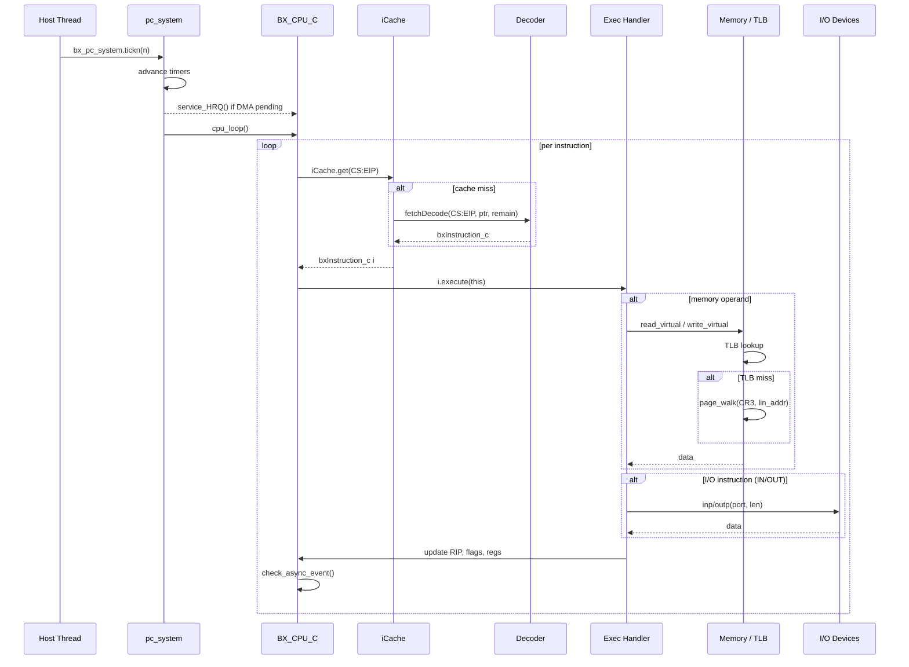

---

## 2. CPU Class Hierarchy

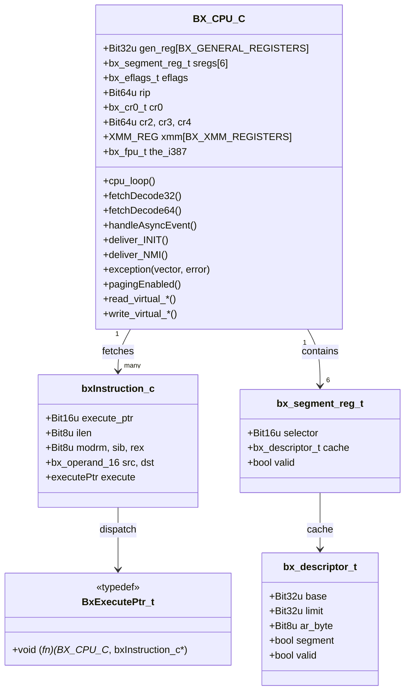

---

## 3. Register File Layout

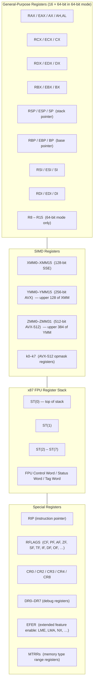

---

## 4. Memory Subsystem

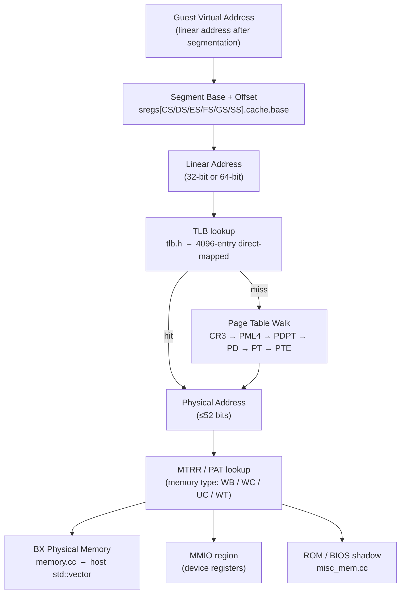

### Memory Map (typical PC layout)

| Range | Contents |
|---|---|
| `0x00000000 – 0x0009FFFF` | Conventional RAM (640 KB) |
| `0x000A0000 – 0x000BFFFF` | VGA frame buffer (MMIO) |
| `0x000C0000 – 0x000FFFFF` | Option ROMs, BIOS shadow |
| `0x00100000 – RAM_end` | Extended RAM |
| `0xFEC00000` | I/O APIC MMIO |
| `0xFEE00000` | Local APIC MMIO |
| `0xFFFF0000 – 0xFFFFFFFF` | BIOS ROM (reset vector at 0xFFFFFFF0) |

---

## 5. Paging & Address Translation

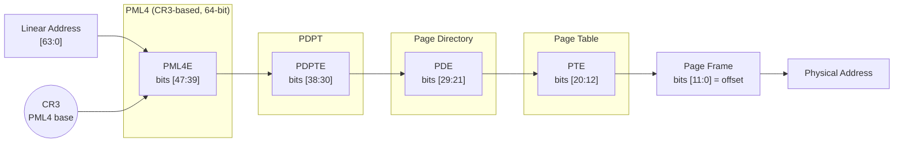

**Fast path via TLB:**  
`tlb.h` maintains a direct-mapped software TLB. On a hit, the linear→physical translation is resolved in a single array lookup, bypassing the four-level walk entirely.

---

## 6. I/O Device Bus Architecture

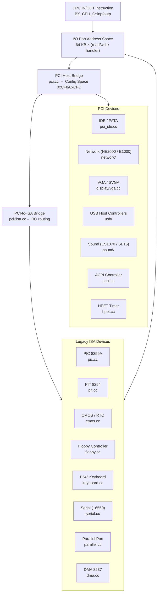

---

## 7. Interrupt & Exception Delivery

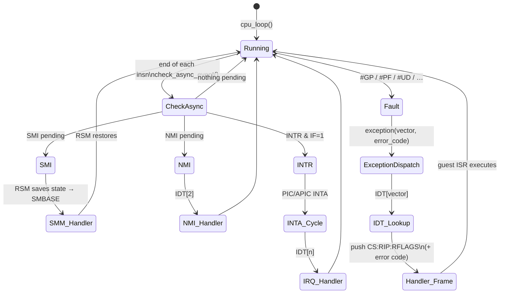

**Exception classes:**

| Class | Behaviour | Examples |
|---|---|---|
| Fault | RIP points to faulting instruction | #GP, #PF, #UD, #NP |
| Trap | RIP points to *next* instruction | #DB (step), #OF |
| Abort | No reliable restart | #MC, #DF |

---

## 8. Timer & Scheduling Model

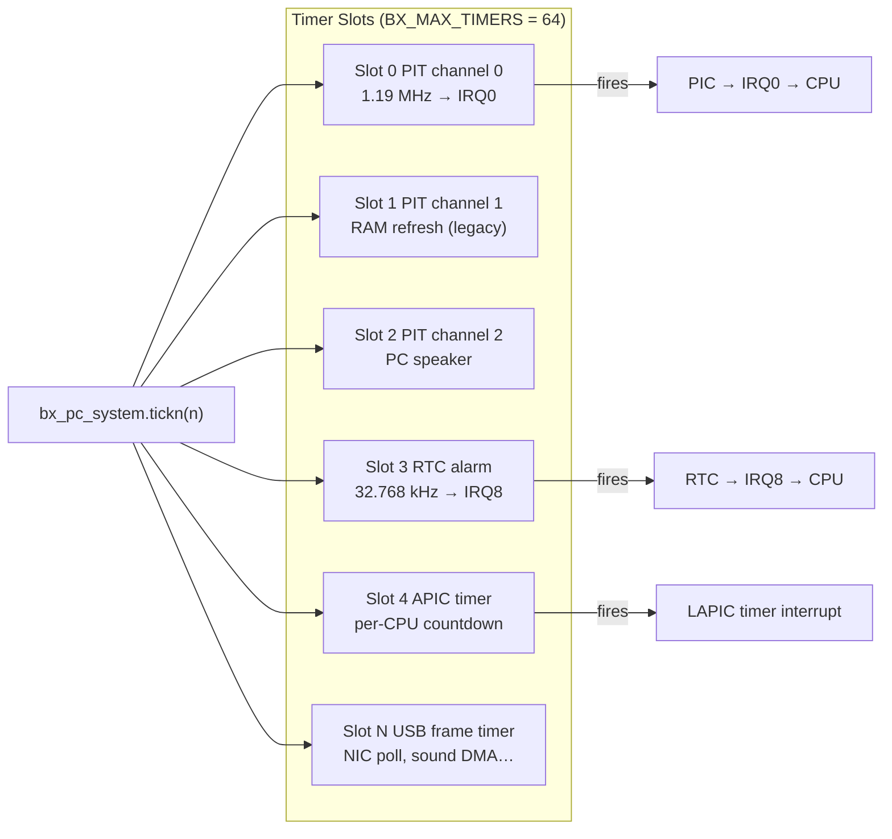

Timer resolution is **one CPU tick** (1 / `cpu_ips`). Devices request a period in ticks; `pc_system` fires the callback when `tickcount >= timeToFire`.

---

## 9. Instruction Cache (iCache)

The iCache is a software-only optimization that avoids re-decoding the same bytes repeatedly:

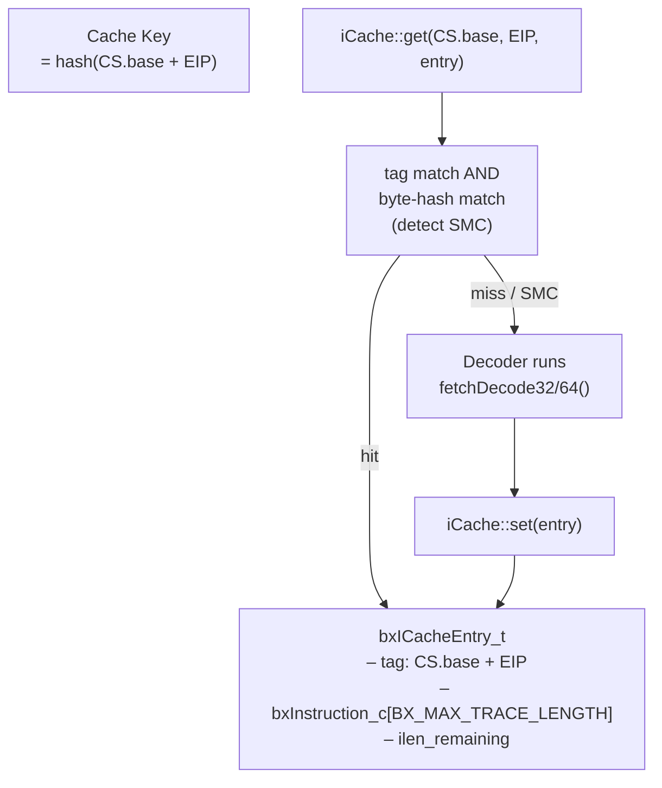

Self-modifying code (SMC) is detected by hashing the instruction bytes at cache-store time and re-validating on each use. This preserves correctness at the cost of a small per-fetch overhead.

---

## 10. Decoder Pipeline

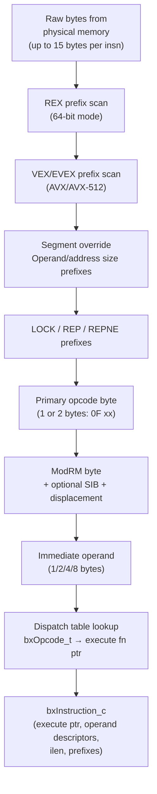

The dispatch table is a two-level array: `BxOpcodeInfo32[256]` (primary) and `BxOpcodeInfo32_2B[256]` (escape `0F`). Each entry holds the execute function pointer and an operand descriptor that drives the ModRM decoder.

---

## 11. SIMD / Vector Extension Architecture

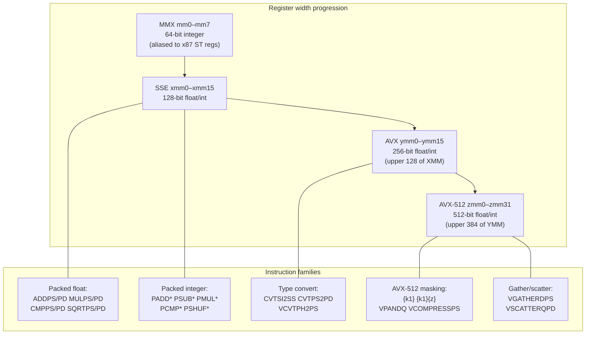

In Bochs, all SIMD state is stored in `BX_CPU_C::xmm[]` (128-bit slots). AVX upper halves are stored in `ymm_hi128[]`. AVX-512 upper halves use `vmm[]`. The `avx/` subdirectory contains one `.cc` file per logical instruction group.

---

## 12. Virtual Machine Extensions (VMX/SVM)

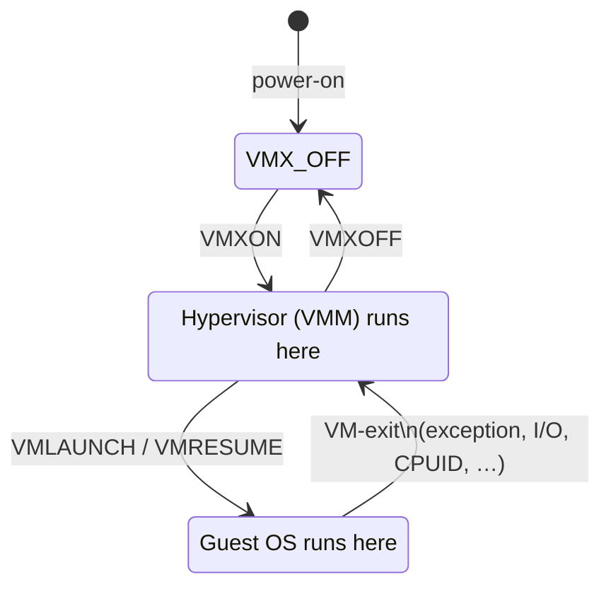

Bochs implements Intel VMX (`vmx.cc`) and AMD SVM (`svm.cc`). The **VMCS** (Virtual Machine Control Structure) holds per-VM state including:
- Guest / host register save areas
- VM-execution control fields (exit conditions)
- VM-exit / VM-entry information fields

On each VM-exit, Bochs copies guest state from the simulated VMCS into `BX_CPU_C` and begins executing the VMM's exit handler. This enables running nested hypervisors inside the emulator.

---

## 13. Neural-Tensor Architecture Counterpart

The table below maps every Bochs architectural concept to its LLM/neural-network analog, providing a precise structural correspondence:

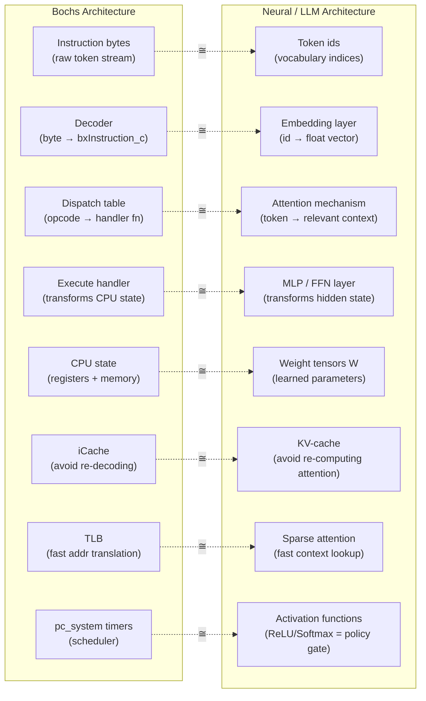

### Key insight: determinism vs. stochasticity

| Property | Bochs | LLM |
|---|---|---|
| State transitions | Deterministic (given input bytes) | Stochastic (temperature-sampled) |
| "Parameters" | Fixed silicon / ISA definition | Gradient-trained float tensors |
| "Program" | x86 machine code | Natural language prompt |
| Optimization | None at runtime (compile-time perf tuning) | Loss minimization during training |
| Correctness | Binary: matches silicon or not | Probabilistic: cross-entropy loss |

The bridge between these two worlds runs through the **activation function**: just as Bochs's `if (modrm.mod == 3)` selects a register vs. memory operand (a hard binary gate = ReLU), a neural network's softmax decides which "next computation" to invoke — a soft, differentiable version of the same dispatch mechanism.

---

## Further Reading

- [`overview.md`](./overview.md) — high-level system overview
- [`architecture-evolution-and-llm-insights.md`](./architecture-evolution-and-llm-insights.md) — conceptual evolution narrative
- [`formal-spec-z-plus-plus.md`](./formal-spec-z-plus-plus.md) — mathematical formal specification
- Bochs source: `bochs/cpu/cpu.h`, `bochs/cpu/decoder/`, `bochs/memory/memory.cc`
- Intel SDM Vol. 3A: *System Programming Guide*
